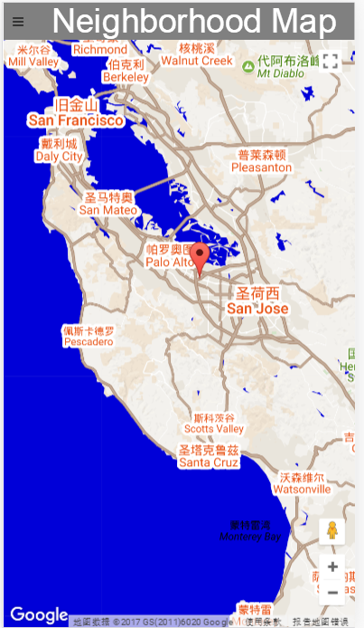
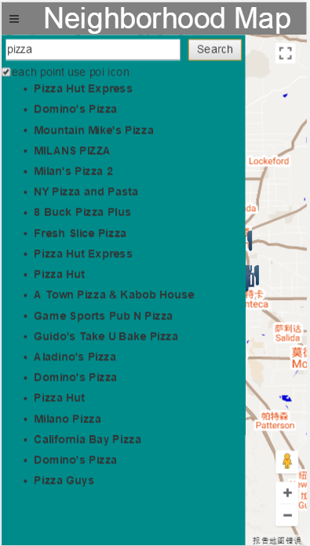
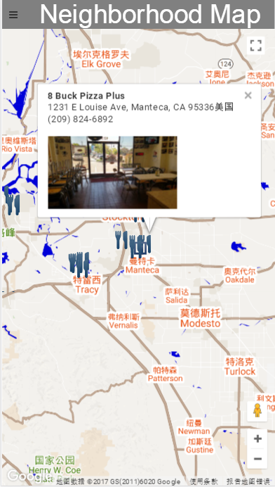
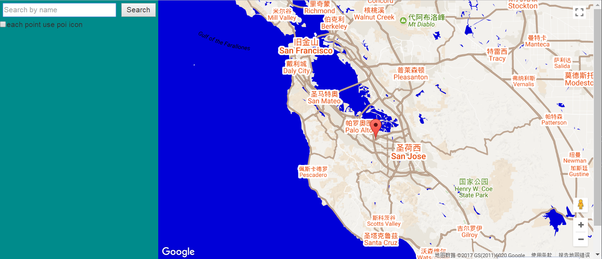
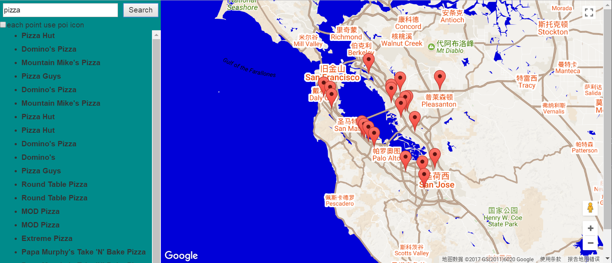
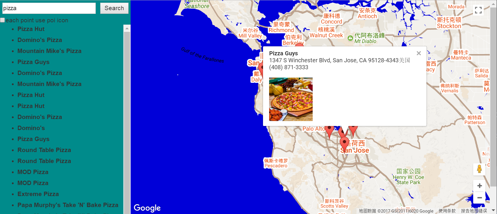

# FEND_Neighborhood_Map

基于javascript 前端技术实现的 街区地图Web应用，选择的地点的世界创新中心 硅谷。

## 使用步骤

### 1. 移动端

首先，打开网页



然后点击左上角的菜单，出现左侧框，输入 关键词，然后搜索



在列表中选择你要看得详细地点




### 2. 网页端

首先，打开网页



然后在左侧框，直接输入 关键词，然后搜索，和移动端不同的是，左侧栏会一致存在



在列表中选择你要看得详细地点



## 部署方式

 采用 gulp 的方式来构建

 使用 gulp 自动化构建 主要是为了两个目的

 - 将 ES6 编写 javascrupt 转化为 ES5, 这样达到更好的兼容性
 - 将 html,js,css 都做一轮压缩，这样将来最节约流量空间

部署方式如下：

在当前目录下，运行

```
npm install  --save-dev
```
自动根据 package.json 内容下载安装插件

安装完成后，运行

```
gulp 
```

就能完成构建了。

这里有三个目录

- src 是开发所用的目录
- dist 是最终发布的目录
- tmp 是临时目录，主要用于 ES6生辰ES5的 js代码做过度

## 使用到的技术

- 响应式网页设计，在PC和手机上都能正常访问，且保持不错的体验
- 基于Promise的第三方API的调用
- 使用knockoutjs 的 MVVM模式，快速绑定和开发界面
- 对Google Map API的深度调用
- 对Google Map 的样式自定义
- 使用gulp来自动化 构建前端

## 参考

- 使用了 [和风API](https://www.heweather.com/) 第三方接口调用